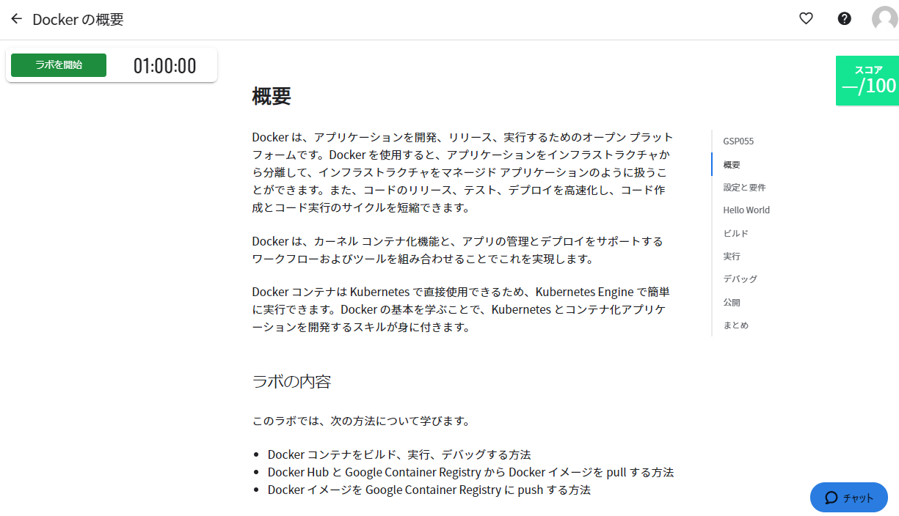

# ラボの開始方法

 

## AWS ラボの開始方法

  
1. Google Chrome のシークレットウィンドウで、インストラクターに指定された URL からラボのトップページにアクセスします。    
  
   
    
    
  
2. このページの中央ペインに、演習の概要と作業手順が記載されています。  
   まず「概要」に目を通し、ラボの大まかな内容を確認します。    
   
   
    
    

3. 画面左上の [ラボを開始] をクリックします。  
   [一緒に開始：クレジット] と記載されたボタンをクリックします。    
   
     
      
   ラボリソースのプロビジョニングが開始され、完了するまでの推定時間が表示されます。
 
    

4. リソースのプロビジョニングが完了したら、[Console を開く] をクリックします。  
     Google Chrome で別タブが開き、AWS の Web のインターフェースである「マネジメントコンソール」に自動的にログインします。  
      
      
      
    ※ 別途指示がない限り、リージョンは変更しないでください
    
5. ログインに失敗した場合は、上の手順で開いたタブを閉じ、ラボのトップページで再度 [Console を開く] をクリックします。

    

6. ラボ トップページの中央ペインの記載された作業手順(タスク 1 以降)に従ってラボを進めます。  
      
   
    
    
  

7. すべての手順が終了し「ラボを終了する」まで来たら、 AWS マネージメント コンソールの右上にある「qwiklabs-XXXXX@XXXXXX」の部分から必ずサインアウトしてください。
 
    

8. ラボ トップページで [ラボを終了] ボタンをクリックします。
    
 
  
   

## Google Cloud ラボの開始方法  
 
1. Google Chrome のシークレットウィンドウで、インストラクターに指定された URL からラボのトップページにアクセスします。    
   
   
    
      
  
2. このページの中央ペインに、演習の概要と作業手順が記載されています。  
   まず「概要」に目を通し、ラボの大まかな内容を確認します。  
   
   

    

3. 画面左上の [ラボを開始] をクリックします。  
   [一緒に開始：クレジット] と記載されたボタンをクリックします。  
   
     
   
   ラボ用のリソースのプロビジョニングが開始され、完了するまでの推定時間が表示されます。  
   
    
    
4. ラボ用リソースのプロビジョニングが完了すると、ラボで使用する Google アカウントのユーザー名とパスワードが記載されたパネルが表示されます。  
   [ユーザー名] をコピーして [Google Console を開く] をクリックします。  
   
   
    
    

5. Chrome で新しいタブが開きます。  
   コピーした [ユーザー名] をペーストして [次へ] をクリックします。  
   
   

    
    
6. Chrome の元のタブ(ラボのトップページ)から [パスワード] をコピーしてペーストし、[次へ] をクリックします。    
   
   

    
    
7. 画面下の [Accept] をクリックします。  
   
   
 
 
   
8. 画面右下の [CONFIRM] をクリックします。  
   
   
    
      

9. [Terms of Service] にチェックして [AGREE AND CONTINUE] をクリックします。これで GCP の Web のインターフェースである Cloud Console へのログインが完了しました。  
   
   

    
    
10. 画面右上の、3 点リーダー アイコンをクリックし、[Preference] をクリックします。  
      
  
         
    
11. 左ペインのナビゲーションで [Language and region] をクリックし、中央ペインの [Language] から [日本語] を選択して、[SAVE] をクリックします。  
    
      
      
     
    
12. 画面左上のナビゲーション メニューをクリックし、[Cloud の概要] > [ダッシュボード] をクリックします。GCP Console のトップ画面に戻ります。   
    
      
      
    このナビゲーション メニューから、ラボで使用する Google Cloud の各サービスを利用することができます。  
    
       
    
13. Cloud Console のトップ画面に戻ったら、正しくプロジェクトが選択されていることを確認します。  
    Google Cloud というロゴの右部分に、下図のように qwiklabs-gcp- で始まる文字列が表示されていることを確認します。  
    表示されていない場合はこの部分をクリックし、表示されるリストから “qwiklabs-gcp-” で始まる項目を選択します。  
      
      
   
        
    
14. ラボのなかで [Cloud Shell] という機能を使用することがあります。  
    これは Cloud Console に付属しているシェル ターミナル機能です。  
    使用する時は、GCP Console の右上のツールバーにある [Cloud Shell をアクティブにする] ボタンをクリックします。  
    
      
     
       
    
15. [続行] をクリックします。  
    
    
    
     

16. Cloud Shell 環境のプロビジョニングと接続には 5 ～ 20 秒程度かかります。  
    接続すると、下図のようにコマンドプロンプトに黄色い文字でプロジェクト ID が表示されていることを確認してください。      
    
      
      
    黄色い文字でプロジェクト ID が表示されない場合は、いったん Cloud Shell を閉じて、再度 Cloud Shell を開いてください。  

           
    
17. Cloud Shell を Chrome の別タブで開くこともできます。  
    その場合は、Cloud Shell 右上の [新しいウィンドウで開く] アイコンをクリックします。  
    
      
      
    元のタブ (Cloud Console) の Cloud Shell は [閉じる] ボタンで閉じてください。  
      
    
18. ラボのトップページに記載されている作業手順に従って、演習を進めます。  
    「設定と要件」の次のセクションからが具体的な作業手順です。「設定と要件」は読み飛ばして構いません。
